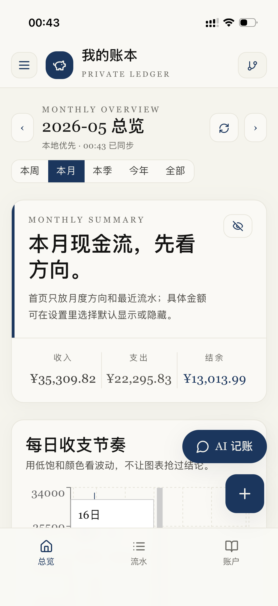
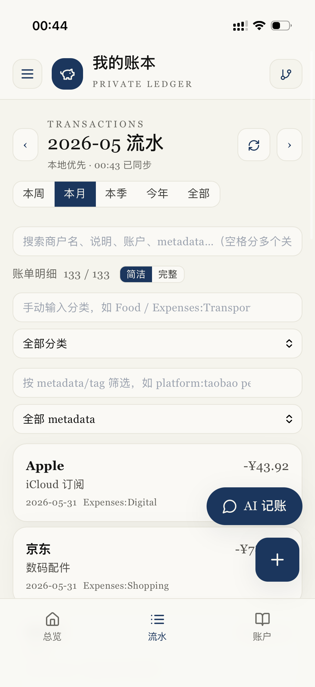
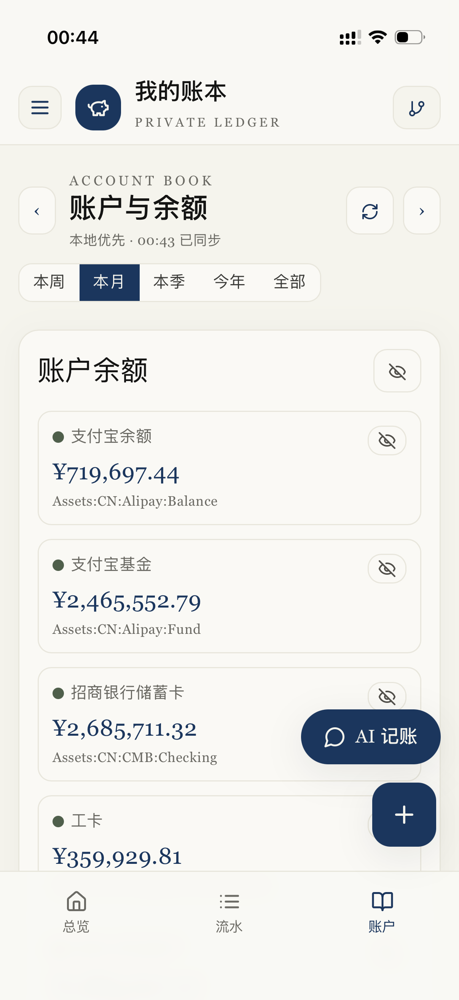
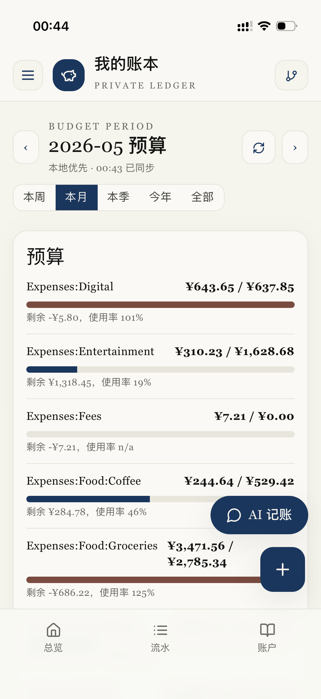
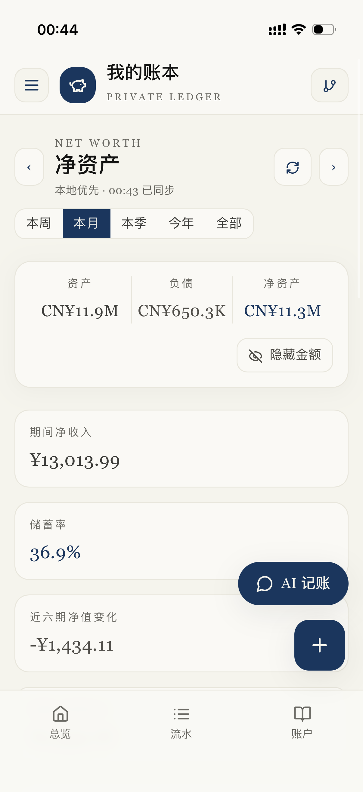
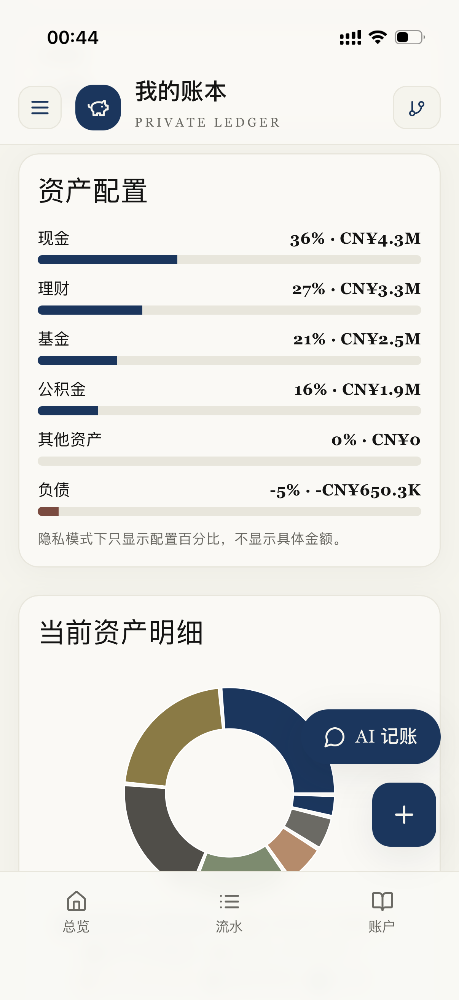
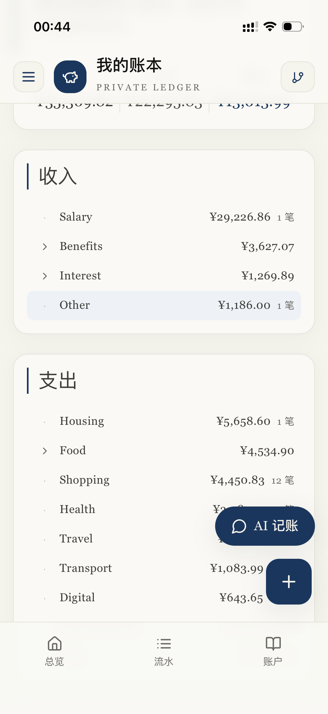
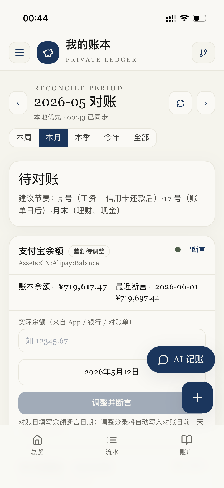
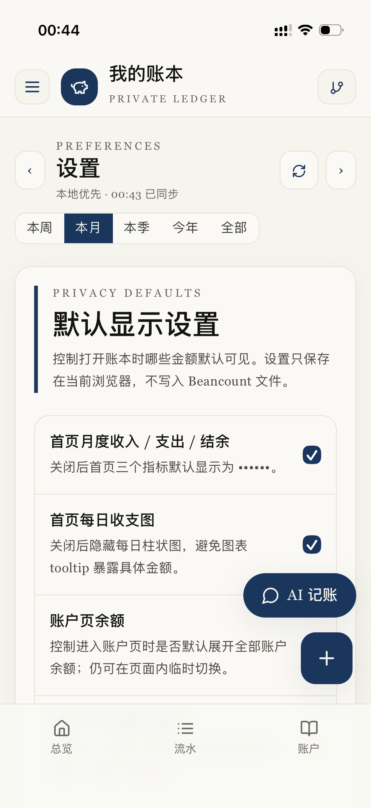
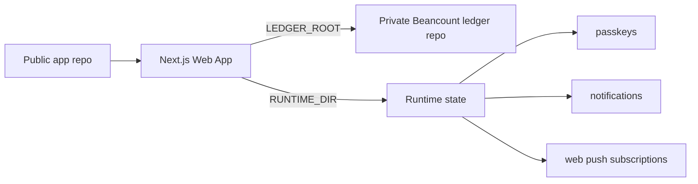

# Beancount Ledger Web

A self-hosted Web UI for a personal [Beancount](https://beancount.github.io/) ledger, with transaction browsing, summaries, budget views, AI-assisted bookkeeping drafts, passkey unlock, web push notifications, and optional Git sync for your private ledger repository.

## Demo

<p align="center">
  
  
  
</p>
<p align="center">
  
  
  
</p>
<p align="center">
  
  
  
</p>

## Repository model

This project is designed for a **two-repository setup**:

1. **Application repository** — this public repo. It contains the Web app, generic scripts, examples, Docker/deployment files, and documentation.
2. **Ledger repository** — your private repo. It contains `main.bean`, `accounts.bean`, `transactions/`, budgets, prices, imports, and your real financial data.



The app never needs your ledger data to be committed to this repository.

## Features

- Beancount transaction list and account views
- Monthly income/expense summaries
- Budget reports from `custom "budget"` directives
- AI natural-language transaction parsing with preview-before-write
- Safe writes with `bean-check` validation and rollback
- Optional ledger Git status, pull, commit, and push
- Password login plus optional passkey / Face ID / Touch ID unlock
- Optional authenticated Fava embed for professional Beancount dashboards
- Optional Web Push notifications

## Quick start

```bash
git clone <this-repo-url> beancount-ledger-web
cd beancount-ledger-web/web
npm install
cp .env.example .env.local
npm run dev
```

By default, local development uses:

```text
../examples/minimal-ledger
```

Open:

```text
http://localhost:3000
```

## Use your private ledger

Clone or create your private ledger somewhere outside this app repository, for example:

```text
~/data/my-beancount-ledger/
├── main.bean
├── accounts.bean
├── commodities.bean
├── budgets.bean
├── prices.bean
└── transactions/
```

Then configure the Web app:

```bash
cd web
cat > .env.local <<'EOF'
LEDGER_ROOT=/absolute/path/to/my-beancount-ledger
RUNTIME_DIR=/absolute/path/to/beancount-ledger-runtime
AUTH_SECRET=replace-with-openssl-rand-base64-32
APP_PASSWORD=replace-with-a-long-password
LEDGER_AI_PROVIDER=deepseek
DEEPSEEK_API_KEY=
LEDGER_GIT_SCHEDULER=false
EOF
npm run dev
```

## Deployment

- [Self-hosting](docs/self-hosting.md)
- [Raspberry Pi GitHub Actions deployment](docs/raspberry-pi.md)
- [Secure Fava systemd integration on Raspberry Pi](docs/raspberry-pi.md#optional-secure-fava-professional-dashboard)
- [Docker Compose example](docker/docker-compose.example.yml)

## Environment variables

See [web/.env.example](web/.env.example) for the complete list.

Important variables:

- `LEDGER_ROOT` — path to your private Beancount ledger repository. Defaults to `../examples/minimal-ledger` for local development.
- `RUNTIME_DIR` — path for runtime-only state such as passkeys, web push subscriptions, notifications, and write locks. Defaults to `$LEDGER_ROOT/.runtime`.
- `APP_PASSWORD` — single-user login password.
- `AUTH_SECRET` — random secret for auth cookies.
- `BEAN_CHECK_BIN` — optional path to `bean-check` if it is not on `PATH`.
- `FAVA_ENABLED` / `FAVA_INTERNAL_URL` — optional authenticated proxy to a localhost/private Fava service. Do not expose Fava directly to the public internet.
- `LEDGER_GIT_SCHEDULER` — set to `true` to periodically pull/commit/push the private ledger repo.

## Ledger layout

A compatible ledger should include at least:

```text
main.bean
accounts.bean
commodities.bean
budgets.bean
prices.bean
transactions/
```

`main.bean` should include the other files, for example:

```beancount
option "title" "My Beancount Ledger"
option "operating_currency" "CNY"

include "commodities.bean"
include "accounts.bean"
include "budgets.bean"
include "prices.bean"
include "transactions/2026.bean"
```

## Examples

- [examples/minimal-ledger](examples/minimal-ledger) — small English example for quick start and CI.
- [examples/chinese-personal-ledger](examples/chinese-personal-ledger) — anonymized Chinese personal finance template.

## Privacy and security

- Keep your real ledger in a private repository.
- Do not commit `.env`, runtime files, API keys, or passkey stores.
- Deploy behind HTTPS if using passkeys or exposing the app outside localhost.
- AI providers receive the text you ask them to parse plus account names needed for validation. Do not send sensitive text to an AI provider you do not trust.
- Writes are previewed first and validated with `bean-check` before being kept.

## Scripts

Generic helper scripts live in [scripts](scripts). They read the ledger path from `LEDGER_ROOT` or `BUB_LEDGER_ROOT`.

Examples:

```bash
LEDGER_ROOT=/path/to/private-ledger python3 scripts/bub_query.py summary 2026-01
LEDGER_ROOT=/path/to/private-ledger python3 scripts/budget_report.py 2026-01 --ledger /path/to/private-ledger/main.bean
```

## Development

```bash
cd web
npm install
npm run typecheck
npm run build
```

## License

Add your chosen open-source license in [LICENSE](LICENSE) before publishing.
