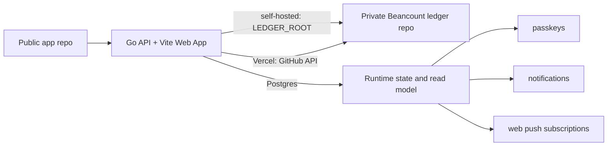

# Beancount Ledger Web

A self-hosted Web UI for a personal [Beancount](https://beancount.github.io/) ledger, with transaction browsing, summaries, budget views, AI-assisted bookkeeping drafts, passkey unlock, web push notifications, and GitHub API writes for your private ledger repository.

## Demo

<p align="center">
  
  
  
</p>
<p align="center">
  
  
  
</p>
<p align="center">
  
  
  
</p>

## Repository model

This project is designed for a **two-repository setup**:

1. **Application repository** — this public repo. It contains the Web app, generic scripts, examples, Docker/deployment files, and documentation.
2. **Ledger repository** — your private repo. It contains `main.bean`, `accounts.bean`, `transactions/`, budgets, prices, imports, and your real financial data.



The app never needs your ledger data to be committed to this repository.

## Features

- Beancount transaction list and account views
- Monthly income/expense summaries
- Budget reports from `custom "budget"` directives
- AI natural-language transaction parsing with preview-before-write
- Safe writes with `bean-check` validation and rollback
- Optional ledger Git status, pull, commit, and push
- Password login plus optional passkey / Face ID / Touch ID unlock
- Optional Web Push notifications
- Statement import previews for Alipay, WeChat Pay, CMB credit cards, CMB checking accounts, and CCB credit cards

## Quick start

Run the Go server close to your private ledger and install the web client as a
PWA from that local origin. The browser caches the app shell, cached ledger
snapshots, and pending write queue, while every final ledger write still goes
through the Go API, validation, rollback handling, and either GitHub API writes
or local filesystem writes.

See [docs/local-first-pwa.md](docs/local-first-pwa.md) for the recommended
local-first topology and offline behavior.

See [web/.env.example](web/.env.example) for the full environment configuration.

## Deployment

The recommended deployment runs a stateless `ledger-web` service plus a
separately scheduled `ledger-indexer` job. The private ledger GitHub repository
remains the source of truth; Postgres stores the ledger read model and all
application runtime state.

Vercel remains useful for pull-request previews or hosted deployments. Connect
the GitHub repository with the root `vercel.json`; the project defines two
Vercel Services in one deployment: the Vite frontend under `web/` and the Go
backend container from `Dockerfile.vercel`. Requests to `/api/*` route to the
backend service; every other path routes to the frontend service. Configure
environment variables in the Vercel dashboard:

- `LEDGER_GITHUB_OWNER` / `LEDGER_GITHUB_REPO` — private ledger repository owner and name.
- `LEDGER_GITHUB_TOKEN` — fine-grained GitHub token with Contents read/write access to the private ledger repository.
- `LEDGER_GIT_BRANCH=main` — branch to read and update through the GitHub API.
- `DATABASE_URL` — Postgres connection string for the read model, runtime state, locks, and import preview files.

Do not set `LEDGER_STORAGE`, `LEDGER_READ_MODEL`, `LEDGER_READ_MODEL_STRICT`,
`LEDGER_ROOT`, `RUNTIME_DIR`, or `BEAN_CHECK_BIN` on the API service.
`ledger-web` fixes these internally: reads are strict Postgres reads, writes go
through the GitHub API, and runtime data lives in Postgres.

The private ledger repository owns the `Index Ledger Web` workflow. It indexes
every main-branch push and runs a 30-minute recovery schedule. Run it with
`force_rebuild=true` after an index format migration to rebuild the active
Postgres revision from the checked-out private ledger.

See [web/.env.example](web/.env.example) for the complete list.

If you previously used a separate `web/` Vercel project for frontend-only
previews, disable it or remove its pull-request comments after switching to the
root services project. The standalone frontend config no longer proxies `/api/*`
to production.

### Docker Compose with Supabase Postgres

Compose separates the API server, static frontend, Caddy HTTPS proxy, and
one-shot indexer.
Copy `.env.example` to `.env`, set the GitHub and Postgres values, and keep that
file uncommitted. Each service has a profile, so it can be built, started, and
updated independently.

```bash
# API only, available at http://localhost:3000
docker compose --env-file .env -f docker/docker-compose.yml --profile server up -d --build

# Frontend only, available at http://localhost:8080
docker compose --env-file .env -f docker/docker-compose.yml --profile frontend up -d --build

# HTTPS edge proxy only. It proxies /api/* to server and every other path to frontend.
docker compose --env-file .env -f docker/docker-compose.yml --profile caddy up -d --build

# Full web application through Caddy.
docker compose --env-file .env -f docker/docker-compose.yml --profile server --profile frontend --profile caddy up -d --build

# Refresh the read model from a mounted local private ledger, then exit.
LEDGER_HOST_PATH=/path/to/private-ledger \
  docker compose --env-file .env -f docker/docker-compose.yml --profile indexer run --rm --build indexer
```

Run `docker compose --env-file .env -f docker/docker-compose.yml up -d --build server`,
`frontend`, or `caddy` to update one long-running service. Set
`CADDY_SITE_ADDRESS` to a domain for Caddy-managed HTTPS. The `caddy_data`
volume retains certificates and Caddy state across Caddy image updates.
`server` binds its published port to localhost by default; Caddy reaches it on
the internal Compose network. Set `SERVER_BIND_ADDRESS=0.0.0.0` only when the
API itself needs a remote listener.

To serve the SPA from the `server` container without starting `frontend`, set
`SERVER_BUILD_TARGET=standalone` and `CADDY_FRONTEND_UPSTREAM=server:3000`.
Set `CADDY_FRONTEND_UPSTREAM=frontend:80` when the separate frontend service is
running.

For a pre-existing Caddy internal CA, set `CADDY_TLS_DIRECTIVE=tls internal`,
select the existing `CADDY_DATA_VOLUME` and `CADDY_CONFIG_VOLUME`, then set
`CADDY_VOLUMES_EXTERNAL=true`. The `caddy_data` volume contains the local CA
and issued certificates, so this retains trust for already configured clients.

The indexer mounts `LEDGER_HOST_PATH` at `/data/ledger`, indexes it into
Postgres, and exits. Clone, sync, and schedule that checkout outside the
container; use cron, systemd, GitHub Actions, or your container platform to
invoke the Compose indexer on a schedule.

## Environment variables

See [web/.env.example](web/.env.example) for the complete list.

Important variables:

- `LEDGER_GITHUB_OWNER` / `LEDGER_GITHUB_REPO` / `LEDGER_GITHUB_TOKEN` — GitHub API write configuration for `ledger-web`.
- `DATABASE_URL` — required for the ledger read model, runtime state, locks, rate limits, web push subscriptions, notifications, and import preview files.
- `LEDGER_ROOT` — indexer-only path to a local private ledger checkout or mounted copy.
- `APP_PASSWORD` — single-user login password.
- `AUTH_SECRET` — random secret for auth cookies.
- `PUBLIC_ORIGIN` / `WEBAUTHN_PUBLIC_ORIGIN` / `WEBAUTHN_RP_ID` — public browser origin, allowed passkey origins, and passkey RP ID. Keep `WEBAUTHN_RP_ID` on the original registration domain to preserve existing passkeys after a domain move.
- `BEAN_CHECK_BIN` — optional path to `bean-check` for index worker validation. It is not needed on API hosts.
- `LEDGER_GIT_AUTHOR_NAME` / `LEDGER_GIT_AUTHOR_EMAIL` — Git commit identity for app-created ledger commits.
- `LEDGER_STORAGE`, `LEDGER_READ_MODEL`, `LEDGER_READ_MODEL_STRICT`, `RUNTIME_DIR`, `LEDGER_INDEX_INTERVAL_SECONDS`, and `LEDGER_GIT_SCHEDULER` — removed from production runtime configuration.

### Postgres ledger read model

For hosted deployments where cold Git checkout and full Beancount parsing are too
slow, run the API and the index worker separately:

```text
private Beancount Git repo -> ledger-indexer -> Postgres read model -> ledger-web API
```

The Beancount files remain the only source of truth. `ledger-indexer` validates
an existing local checkout or mounted ledger directory, parses it, writes a
revision-scoped normalized projection to Postgres, then atomically marks the
revision active. `ledger-web` can then serve `/api/ledger/*` reads from Postgres
without requiring a local checkout in the API service.

The API host needs `DATABASE_URL` and the explicit GitHub repository/token
variables. Ledger read endpoints use Postgres only. Import commit and editor
save create GitHub commits directly, mark the read model as pending, and the
private-ledger indexer updates Postgres from that commit. Import
preview in GitHub API mode does not parse the full ledger or run the ledger-file
dedup script; instead it dedups against the Postgres read model by statement
metadata, order IDs, exact transaction signatures, and funding-account postings.
Review any remaining preview rows before committing.

The index worker needs `LEDGER_ROOT` and `DATABASE_URL`. It runs one indexing
pass and exits, so schedule it externally with cron, systemd timers, GitHub
Actions, or your container platform. The API and worker both use the default
`ledger#<branch>` index namespace, so no separate source-key variable is needed
for the normal single-ledger deployment. Keep the mounted ledger checkout and
Beancount tooling on the worker side; keep them off the hosted API service.
The indexer holds a Postgres advisory lock while publishing, so set
`POSTGRES_MAX_OPEN_CONNS` to at least `2` when configuring a finite pool.

#### GitHub Actions indexer

Install `Index Ledger Web` in the private ledger repository. It checks out the
private ledger at the triggering commit, checks out this application repository,
sets `LEDGER_ROOT`, and runs:

```bash
cd server
go run ./cmd/ledger-indexer
```

Configure `DATABASE_URL` as a private-ledger Actions secret. `LEDGER_WEB_APP_REF`
selects the application revision. The workflow indexes `main` into the
`ledger#main` Postgres source key.

To migrate an older filesystem runtime directory into Postgres:

```bash
go run ./cmd/ledger-state-migrate -runtime-dir /path/to/runtime
go run ./cmd/ledger-state-migrate -runtime-dir /path/to/runtime -write
```

The first command is a dry run. The second writes idempotent runtime JSON and
import preview blobs to Postgres.

## Ledger layout

A compatible ledger should include at least:

```text
main.bean
accounts.bean
commodities.bean
budgets.bean
prices.bean
transactions/
```

`main.bean` should include the other files, for example:

```beancount
option "title" "My Beancount Ledger"
option "operating_currency" "CNY"

include "commodities.bean"
include "accounts.bean"
include "budgets.bean"
include "prices.bean"
include "transactions/2026.bean"
```

## Statement imports

The import flow keeps provider logic behind a small engine abstraction:

- DEG providers use `deg-module`: Alipay, WeChat Pay, and CMB credit card statements load the same YAML config files used by double-entry-generator.
- CMB checking-account CSV/PDF statements use the Web PDF adapter plus DEG's `cmb` provider through the `cmb-checking` import source.
- Native providers use the same Web preview, dedup, and commit flow with DEG-style YAML config: `ccb-credit` for CCB credit card email/HTML/CSV statements.

Ledger-side import files live under `$LEDGER_ROOT/imports/`. CMB checking import expects `imports/cmb-checking-config.yaml`; see [examples/preview-ledger/imports/cmb-checking-config.yaml](examples/preview-ledger/imports/cmb-checking-config.yaml) for the DEG `cmb` config shape. CCB credit card import expects `imports/ccb-credit-card-config.yaml` and accepts `.eml`, `.html`, `.htm`, or normalized `.csv` files. The `ccbCredit.paymentSourceHandledExternally` config controls prefixes such as `支付宝-`, `财付通-`, and `微信支付-` that should be filtered before generation to avoid duplicate platform-payment imports.

## Examples

- [examples/minimal-ledger](examples/minimal-ledger) — small English example for quick start and CI.
- [examples/chinese-personal-ledger](examples/chinese-personal-ledger) — anonymized Chinese personal finance template.

## Privacy and security

- Keep your real ledger in a private repository.
- Do not commit `.env`, runtime files, API keys, or passkey stores.
- Deploy behind HTTPS if using passkeys or exposing the app outside localhost.
- AI providers receive the text you ask them to parse plus account names needed for validation. Do not send sensitive text to an AI provider you do not trust.
- Writes are previewed first and validated with `bean-check` before being kept.

## Scripts

Generic helper scripts live in [scripts](scripts). They read the ledger path from `LEDGER_ROOT` or `BUB_LEDGER_ROOT`.

Examples:

```bash
LEDGER_ROOT=/path/to/private-ledger python3 scripts/bub_query.py summary 2026-01
LEDGER_ROOT=/path/to/private-ledger python3 scripts/budget_report.py 2026-01 --ledger /path/to/private-ledger/main.bean
```

## Development

```bash
cd web
pnpm install
pnpm run typecheck
pnpm run build
```

## License

Add your chosen open-source license in [LICENSE](LICENSE) before publishing.
