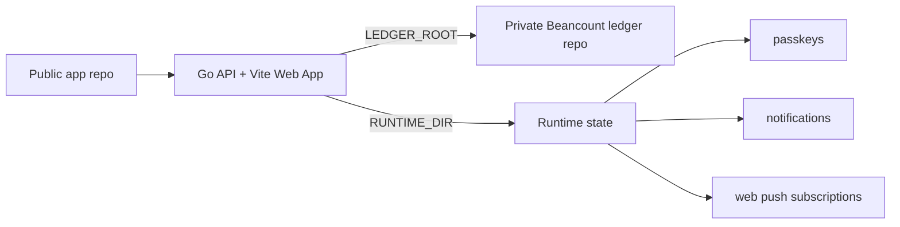

# Beancount Ledger Web

A self-hosted Web UI for a personal [Beancount](https://beancount.github.io/) ledger, with transaction browsing, summaries, budget views, AI-assisted bookkeeping drafts, passkey unlock, web push notifications, and optional Git sync for your private ledger repository.

## Demo

<p align="center">
  
  
  
</p>
<p align="center">
  
  
  
</p>
<p align="center">
  
  
  
</p>

## Repository model

This project is designed for a **two-repository setup**:

1. **Application repository** — this public repo. It contains the Web app, generic scripts, examples, Docker/deployment files, and documentation.
2. **Ledger repository** — your private repo. It contains `main.bean`, `accounts.bean`, `transactions/`, budgets, prices, imports, and your real financial data.



The app never needs your ledger data to be committed to this repository.

## Features

- Beancount transaction list and account views
- Monthly income/expense summaries
- Budget reports from `custom "budget"` directives
- AI natural-language transaction parsing with preview-before-write
- Safe writes with `bean-check` validation and rollback
- Optional ledger Git status, pull, commit, and push
- Password login plus optional passkey / Face ID / Touch ID unlock
- Optional Web Push notifications
- Statement import previews for Alipay, WeChat Pay, CMB credit cards, CMB checking accounts, and CCB credit cards

## Quick start

Deploy to Vercel with the root `vercel.json`. The project defines two Vercel
Services in one deployment: the Vite frontend under `web/` and the Go backend
container from `Dockerfile.vercel`. Requests to `/api/*` route to the backend
service; every other path routes to the frontend service. Pull-request previews
therefore test the frontend and backend from the same deployment instead of
calling the production API from a standalone frontend preview.

See [web/.env.example](web/.env.example) for the full environment configuration.

## Deployment

Deploy to Vercel by connecting the GitHub repository. The app runs as a single
Vercel project with frontend and backend services. Configure environment
variables in the Vercel dashboard:

- `LEDGER_STORAGE=remote_git` — the server clones `LEDGER_GIT_REMOTE` into `LEDGER_GIT_WORKDIR/repo`, runs `bean-check`, and commits/pushes every successful ledger write.
- `LEDGER_GIT_REMOTE` — your private ledger repository URL (with credentials if needed).
- `RUNTIME_STORE=postgres` — persist passkeys, web push subscriptions, notifications, and write locks in Postgres.
- `DATABASE_URL` — Postgres connection string.

See [web/.env.example](web/.env.example) for the complete list.

If you previously used a separate `web/` Vercel project for frontend-only
previews, disable it or remove its pull-request comments after switching to the
root services project. The standalone frontend config no longer proxies `/api/*`
to production.

## Environment variables

See [web/.env.example](web/.env.example) for the complete list.

Important variables:

- `LEDGER_STORAGE=remote_git` — the server clones `LEDGER_GIT_REMOTE` into `LEDGER_GIT_WORKDIR/repo`, runs `bean-check`, and commits/pushes every successful ledger write.
- `LEDGER_GIT_REMOTE` — your private ledger repository URL (with credentials if needed).
- `RUNTIME_STORE=postgres` / `DATABASE_URL` — persist passkeys, web push subscriptions, notifications, and write locks in Postgres.
- `RUNTIME_FILE_STORE=filesystem|postgres` — optional override for runtime files. Defaults to `RUNTIME_STORE`.
- `APP_PASSWORD` — single-user login password.
- `AUTH_SECRET` — random secret for auth cookies.
- `PUBLIC_ORIGIN` / `WEBAUTHN_PUBLIC_ORIGIN` / `WEBAUTHN_RP_ID` — public browser origin, allowed passkey origins, and passkey RP ID. Keep `WEBAUTHN_RP_ID` on the original registration domain to preserve existing passkeys after a domain move.
- `BEAN_CHECK_BIN` — optional path to `bean-check` if not on `PATH`.
- `LEDGER_GIT_AUTHOR_NAME` / `LEDGER_GIT_AUTHOR_EMAIL` — Git commit identity for app-created ledger commits.
- `LEDGER_GIT_SCHEDULER` — enable periodic git pull of the private ledger repo.

## Ledger layout

A compatible ledger should include at least:

```text
main.bean
accounts.bean
commodities.bean
budgets.bean
prices.bean
transactions/
```

`main.bean` should include the other files, for example:

```beancount
option "title" "My Beancount Ledger"
option "operating_currency" "CNY"

include "commodities.bean"
include "accounts.bean"
include "budgets.bean"
include "prices.bean"
include "transactions/2026.bean"
```

## Statement imports

The import flow keeps provider logic behind a small engine abstraction:

- DEG providers use `deg-module`: Alipay, WeChat Pay, and CMB credit card statements load the same YAML config files used by double-entry-generator.
- CMB checking-account CSV/PDF statements use the Web PDF adapter plus DEG's `cmb` provider through the `cmb-checking` import source.
- Native providers use the same Web preview, dedup, and commit flow with DEG-style YAML config: `ccb-credit` for CCB credit card email/HTML/CSV statements.

Ledger-side import files live under `$LEDGER_ROOT/imports/`. CMB checking import expects `imports/cmb-checking-config.yaml`; see [examples/preview-ledger/imports/cmb-checking-config.yaml](examples/preview-ledger/imports/cmb-checking-config.yaml) for the DEG `cmb` config shape. CCB credit card import expects `imports/ccb-credit-card-config.yaml` and accepts `.eml`, `.html`, `.htm`, or normalized `.csv` files. The `ccbCredit.paymentSourceHandledExternally` config controls prefixes such as `支付宝-`, `财付通-`, and `微信支付-` that should be filtered before generation to avoid duplicate platform-payment imports.

## Examples

- [examples/minimal-ledger](examples/minimal-ledger) — small English example for quick start and CI.
- [examples/chinese-personal-ledger](examples/chinese-personal-ledger) — anonymized Chinese personal finance template.

## Privacy and security

- Keep your real ledger in a private repository.
- Do not commit `.env`, runtime files, API keys, or passkey stores.
- Deploy behind HTTPS if using passkeys or exposing the app outside localhost.
- AI providers receive the text you ask them to parse plus account names needed for validation. Do not send sensitive text to an AI provider you do not trust.
- Writes are previewed first and validated with `bean-check` before being kept.

## Scripts

Generic helper scripts live in [scripts](scripts). They read the ledger path from `LEDGER_ROOT` or `BUB_LEDGER_ROOT`.

Examples:

```bash
LEDGER_ROOT=/path/to/private-ledger python3 scripts/bub_query.py summary 2026-01
LEDGER_ROOT=/path/to/private-ledger python3 scripts/budget_report.py 2026-01 --ledger /path/to/private-ledger/main.bean
```

## Development

```bash
cd web
pnpm install
pnpm run typecheck
pnpm run build
```

## License

Add your chosen open-source license in [LICENSE](LICENSE) before publishing.
