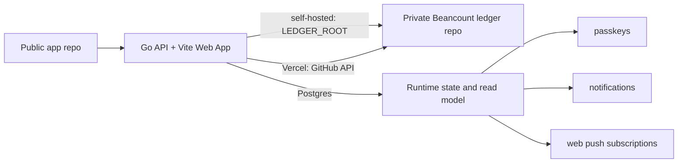

# Beancount Ledger Web

A self-hosted Web UI for a personal [Beancount](https://beancount.github.io/) ledger, with transaction browsing, summaries, budget views, AI-assisted bookkeeping drafts, passkey unlock, web push notifications, and optional Git sync for your private ledger repository.

## Demo

<p align="center">
  
  
  
</p>
<p align="center">
  
  
  
</p>
<p align="center">
  
  
  
</p>

## Repository model

This project is designed for a **two-repository setup**:

1. **Application repository** — this public repo. It contains the Web app, generic scripts, examples, Docker/deployment files, and documentation.
2. **Ledger repository** — your private repo. It contains `main.bean`, `accounts.bean`, `transactions/`, budgets, prices, imports, and your real financial data.



The app never needs your ledger data to be committed to this repository.

## Features

- Beancount transaction list and account views
- Monthly income/expense summaries
- Budget reports from `custom "budget"` directives
- AI natural-language transaction parsing with preview-before-write
- Safe writes with `bean-check` validation and rollback
- Optional ledger Git status, pull, commit, and push
- Password login plus optional passkey / Face ID / Touch ID unlock
- Optional Web Push notifications
- Statement import previews for Alipay, WeChat Pay, CMB credit cards, CMB checking accounts, and CCB credit cards

## Quick start

Run the Go server close to your private ledger and install the web client as a
PWA from that local origin. The browser caches the app shell, cached ledger
snapshots, and pending write queue, while every final ledger write still goes
through the Go API, `bean-check`, rollback handling, and optional Git sync.

See [docs/local-first-pwa.md](docs/local-first-pwa.md) for the recommended
local-first topology and offline behavior.

See [web/.env.example](web/.env.example) for the full environment configuration.

## Deployment

The recommended personal deployment is a self-hosted `ledger-web` server with
`LEDGER_ROOT` pointing at a private ledger repository and `RUNTIME_DIR` pointing
at private runtime storage.

Vercel remains useful for pull-request previews or hosted deployments. Connect
the GitHub repository with the root `vercel.json`; the project defines two
Vercel Services in one deployment: the Vite frontend under `web/` and the Go
backend container from `Dockerfile.vercel`. Requests to `/api/*` route to the
backend service; every other path routes to the frontend service. Configure
environment variables in the Vercel dashboard:

- `LEDGER_STORAGE=github_api` — required for Vercel + Postgres read model. The API host writes supported ledger changes directly to GitHub without cloning the ledger.
- `LEDGER_GITHUB_OWNER` / `LEDGER_GITHUB_REPO` — private ledger repository owner and name.
- `LEDGER_GITHUB_TOKEN` — fine-grained GitHub token with Contents read/write access to the private ledger repository.
- `LEDGER_GIT_BRANCH=main` — branch to read and update through the GitHub API.
- `RUNTIME_STORE=postgres` / `RUNTIME_FILE_STORE=postgres` — persist passkeys, web push subscriptions, notifications, write locks, and import preview files in Postgres.
- `DATABASE_URL` — Postgres connection string.
- `LEDGER_READ_MODEL=postgres` — hosted read path. The API reads the active ledger index from Postgres instead of cloning/parsing the Beancount repository on each cold request.
- `LEDGER_READ_MODEL_STRICT=true` — default when `LEDGER_READ_MODEL=postgres`; prevents the API host from falling back to local Git checkout and parsing.
- `LEDGER_INDEX_SOURCE_KEY` — stable namespace shared by the API host and the index worker, for example `personal-ledger#main`.

Do not set `LEDGER_ROOT`, `LEDGER_GIT_REMOTE`, `LEDGER_GIT_WORKDIR`,
`BEAN_CHECK_BIN`, or `LEDGER_GIT_SCHEDULER` on the Vercel API service. Those
belong to local/self-hosted deployments or the index worker.

See [web/.env.example](web/.env.example) for the complete list.

If you previously used a separate `web/` Vercel project for frontend-only
previews, disable it or remove its pull-request comments after switching to the
root services project. The standalone frontend config no longer proxies `/api/*`
to production.

## Environment variables

See [web/.env.example](web/.env.example) for the complete list.

Important variables:

- `LEDGER_STORAGE=github_api|remote_git|filesystem` — use `github_api` for hosted Vercel API writes, `remote_git` for the local index worker or self-hosted Git sync, and `filesystem` for local ledgers already present on disk.
- `LEDGER_GITHUB_OWNER` / `LEDGER_GITHUB_REPO` / `LEDGER_GITHUB_TOKEN` — GitHub API write configuration for `LEDGER_STORAGE=github_api`.
- `LEDGER_GIT_REMOTE` — private ledger repository URL for `LEDGER_STORAGE=remote_git`; not used by `github_api`.
- `RUNTIME_STORE=postgres` / `DATABASE_URL` — persist passkeys, web push subscriptions, notifications, and write locks in Postgres.
- `RUNTIME_FILE_STORE=filesystem|postgres` — optional override for runtime files. Defaults to `RUNTIME_STORE`.
- `LEDGER_READ_MODEL=files|postgres` — use `postgres` to serve ledger reads from the normalized Postgres read model.
- `LEDGER_READ_MODEL_STRICT=true|false` — when true, the API host returns an error if no active indexed revision exists instead of cloning/parsing local files.
- `LEDGER_INDEX_SOURCE_KEY` — optional stable index namespace. Set the same value on `ledger-web` and `ledger-indexer` so both services read and write the same active ledger projection.
- `LEDGER_INDEX_INTERVAL_SECONDS` — optional worker loop interval for `ledger-indexer`; unset or non-positive runs one indexing pass and exits.
- `APP_PASSWORD` — single-user login password.
- `AUTH_SECRET` — random secret for auth cookies.
- `PUBLIC_ORIGIN` / `WEBAUTHN_PUBLIC_ORIGIN` / `WEBAUTHN_RP_ID` — public browser origin, allowed passkey origins, and passkey RP ID. Keep `WEBAUTHN_RP_ID` on the original registration domain to preserve existing passkeys after a domain move.
- `BEAN_CHECK_BIN` — optional path to `bean-check` for local/self-hosted or index worker validation. It is not needed on Vercel API hosts using `github_api`.
- `LEDGER_GIT_AUTHOR_NAME` / `LEDGER_GIT_AUTHOR_EMAIL` — Git commit identity for app-created ledger commits.
- `LEDGER_GIT_SCHEDULER` — enable periodic git pull of the private ledger repo in self-hosted `remote_git` mode.

### Postgres ledger read model

For hosted deployments where cold Git checkout and full Beancount parsing are too
slow, run the API and the index worker separately:

```text
private Beancount Git repo -> ledger-indexer -> Postgres read model -> ledger-web API
```

The Beancount files remain the only source of truth. `ledger-indexer` clones and
validates the private ledger, parses it, writes a revision-scoped normalized
projection to Postgres, then atomically marks the revision active. `ledger-web`
can then serve `/api/ledger/*` reads from Postgres with
`LEDGER_READ_MODEL=postgres`.

The Vercel API host needs `DATABASE_URL`, `RUNTIME_STORE=postgres`,
`RUNTIME_FILE_STORE=postgres`, `LEDGER_READ_MODEL=postgres`,
`LEDGER_READ_MODEL_STRICT=true`, and the same `LEDGER_INDEX_SOURCE_KEY` as the
worker. Ledger read endpoints use Postgres only. For hosted writes, set
`LEDGER_STORAGE=github_api` plus the explicit GitHub repository/token variables;
the API no longer infers repository identity from `LEDGER_GIT_REMOTE`. Import
commit and editor save create GitHub commits directly, mark the read model as
pending, and the local worker updates Postgres on its next indexing pass. Import
preview in GitHub API mode does not parse the full ledger or run the ledger-file
dedup script; instead it dedups against the Postgres read model by statement
metadata, order IDs, exact transaction signatures, and funding-account postings.
Review any remaining preview rows before committing.

The index worker still needs `LEDGER_STORAGE=remote_git`, `LEDGER_GIT_REMOTE`,
`LEDGER_GIT_BRANCH`, `DATABASE_URL`, `LEDGER_READ_MODEL=postgres`, and the same
`LEDGER_INDEX_SOURCE_KEY`. Keep those local checkout variables off the Vercel
API service.

## Ledger layout

A compatible ledger should include at least:

```text
main.bean
accounts.bean
commodities.bean
budgets.bean
prices.bean
transactions/
```

`main.bean` should include the other files, for example:

```beancount
option "title" "My Beancount Ledger"
option "operating_currency" "CNY"

include "commodities.bean"
include "accounts.bean"
include "budgets.bean"
include "prices.bean"
include "transactions/2026.bean"
```

## Statement imports

The import flow keeps provider logic behind a small engine abstraction:

- DEG providers use `deg-module`: Alipay, WeChat Pay, and CMB credit card statements load the same YAML config files used by double-entry-generator.
- CMB checking-account CSV/PDF statements use the Web PDF adapter plus DEG's `cmb` provider through the `cmb-checking` import source.
- Native providers use the same Web preview, dedup, and commit flow with DEG-style YAML config: `ccb-credit` for CCB credit card email/HTML/CSV statements.

Ledger-side import files live under `$LEDGER_ROOT/imports/`. CMB checking import expects `imports/cmb-checking-config.yaml`; see [examples/preview-ledger/imports/cmb-checking-config.yaml](examples/preview-ledger/imports/cmb-checking-config.yaml) for the DEG `cmb` config shape. CCB credit card import expects `imports/ccb-credit-card-config.yaml` and accepts `.eml`, `.html`, `.htm`, or normalized `.csv` files. The `ccbCredit.paymentSourceHandledExternally` config controls prefixes such as `支付宝-`, `财付通-`, and `微信支付-` that should be filtered before generation to avoid duplicate platform-payment imports.

## Examples

- [examples/minimal-ledger](examples/minimal-ledger) — small English example for quick start and CI.
- [examples/chinese-personal-ledger](examples/chinese-personal-ledger) — anonymized Chinese personal finance template.

## Privacy and security

- Keep your real ledger in a private repository.
- Do not commit `.env`, runtime files, API keys, or passkey stores.
- Deploy behind HTTPS if using passkeys or exposing the app outside localhost.
- AI providers receive the text you ask them to parse plus account names needed for validation. Do not send sensitive text to an AI provider you do not trust.
- Writes are previewed first and validated with `bean-check` before being kept.

## Scripts

Generic helper scripts live in [scripts](scripts). They read the ledger path from `LEDGER_ROOT` or `BUB_LEDGER_ROOT`.

Examples:

```bash
LEDGER_ROOT=/path/to/private-ledger python3 scripts/bub_query.py summary 2026-01
LEDGER_ROOT=/path/to/private-ledger python3 scripts/budget_report.py 2026-01 --ledger /path/to/private-ledger/main.bean
```

## Development

```bash
cd web
pnpm install
pnpm run typecheck
pnpm run build
```

## License

Add your chosen open-source license in [LICENSE](LICENSE) before publishing.
