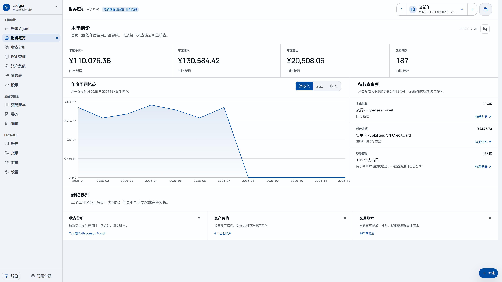
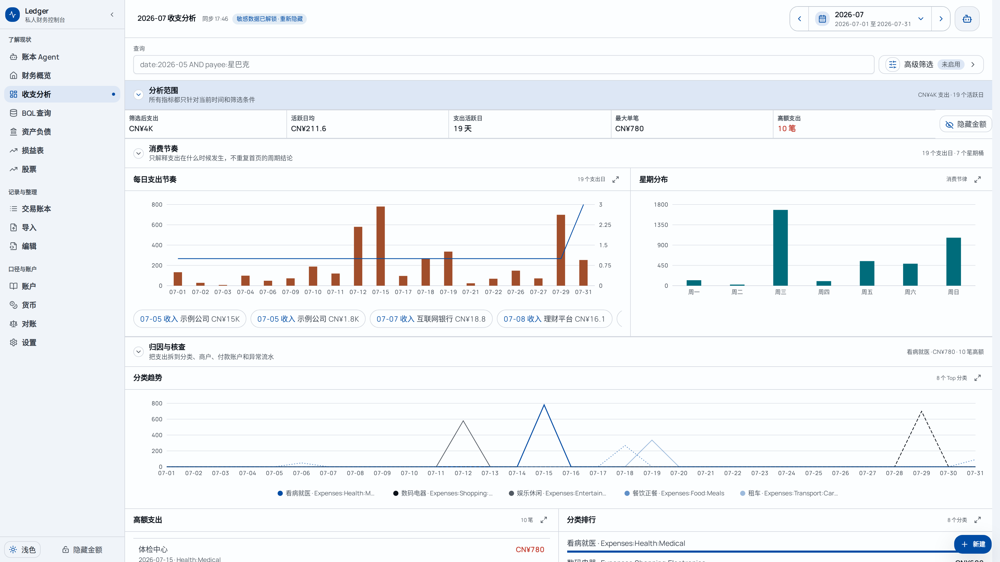
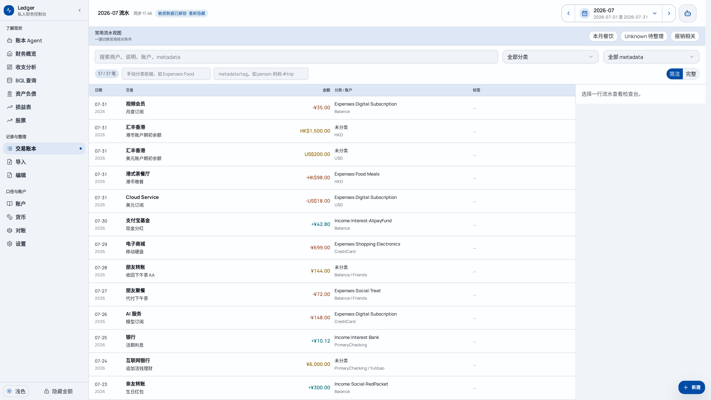
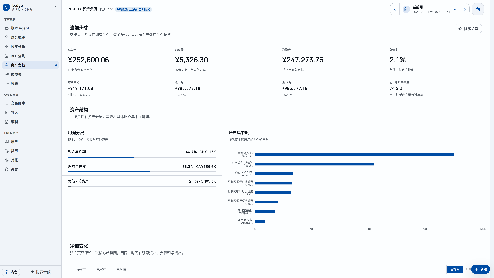
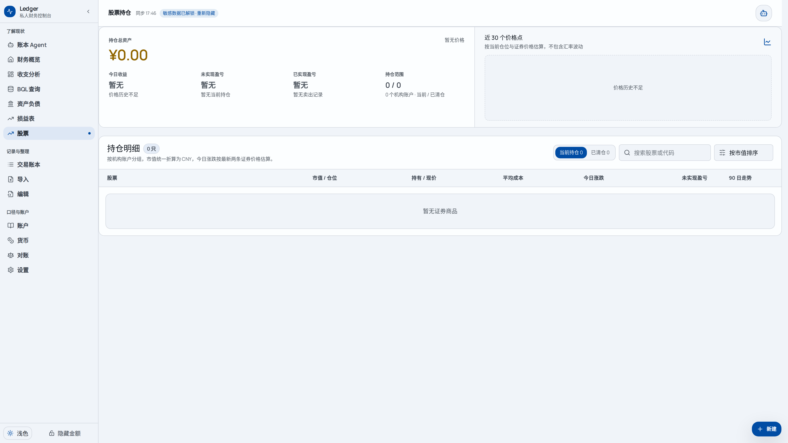
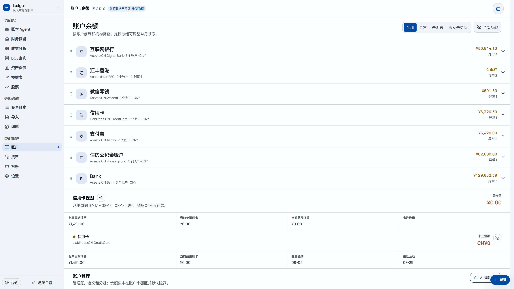
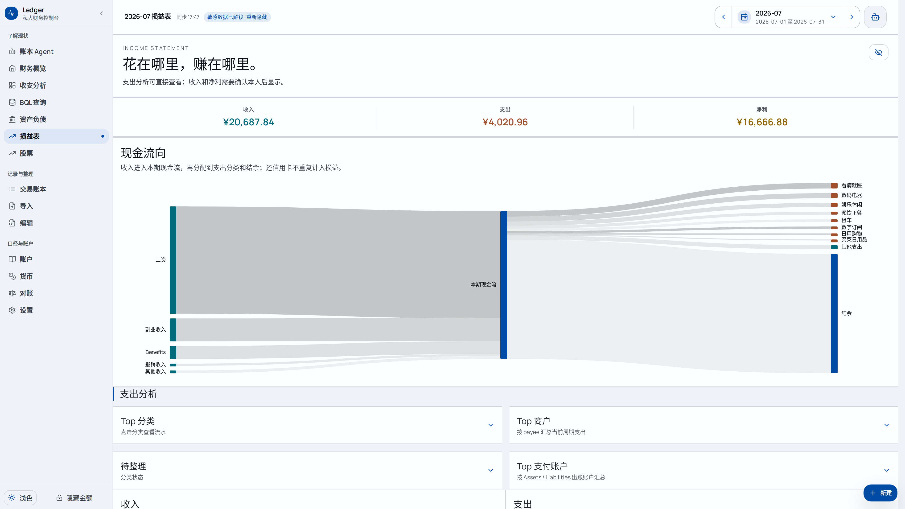
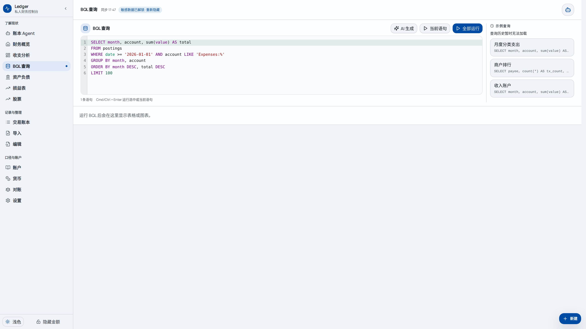
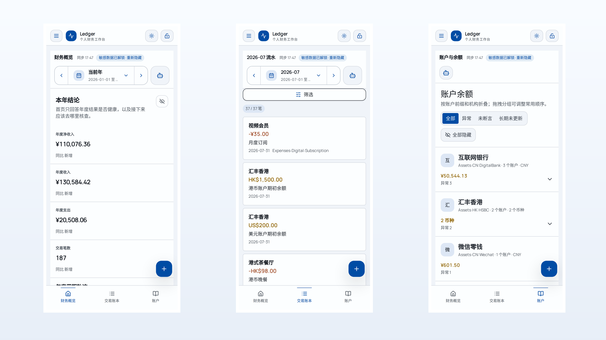
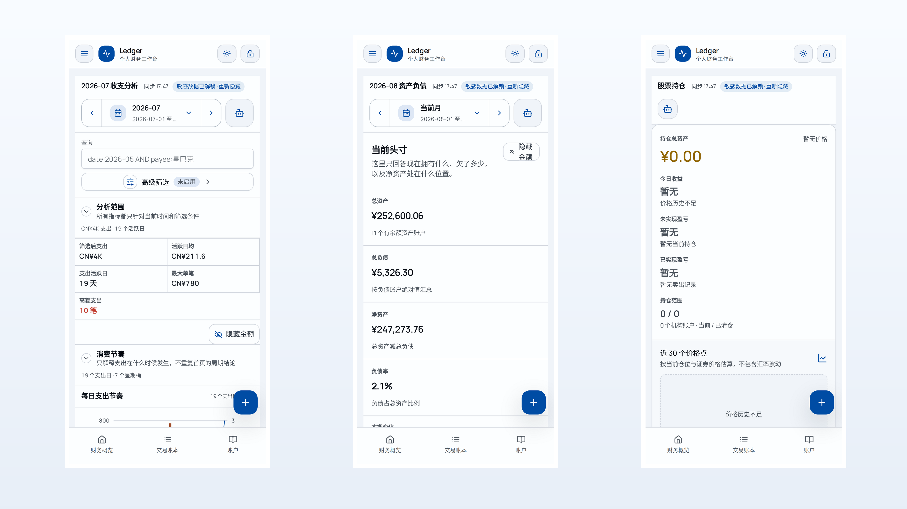

# Beancount Ledger Web

A private web app for a personal [Beancount](https://beancount.github.io/) ledger.

It keeps your real ledger outside this repository and gives you a browser UI
for browsing, reviewing, and safely updating it.

## What it does

- Browse accounts, transactions, balances, budgets, and reports
- Draft transactions from natural language, then preview before writing
- Validate each ledger write with `bean-check` before its GitHub commit
- Review imports from supported payment statements before committing them
- Use password login, passkeys on secure origins, and optional web push
- Run entirely on your own Docker host, or use the hosted GitHub-backed setup
- Read the current month, transactions, and account balances from the native
  iPhone client

## Screenshots

The gallery uses the safe sample data in `examples/preview-ledger`.

### Desktop

<table>
  <tr>
    <td width="50%"></td>
    <td width="50%"></td>
  </tr>
  <tr>
    <td width="50%"></td>
    <td width="50%"></td>
  </tr>
  <tr>
    <td width="50%"></td>
    <td width="50%"></td>
  </tr>
  <tr>
    <td width="50%"></td>
    <td width="50%"></td>
  </tr>
</table>

### Mobile





## Self-hosted Compose

The complete self-hosted stack includes Postgres, API, a private Bub Agent,
indexer, frontend, and Caddy. Your private GitHub ledger remains the source of truth: the API writes
through the GitHub API, while only the indexer has a local checkout for
publishing the Postgres read model.

```bash
cp .env.selfhost.example .env.selfhost
# Set the checkout path, UID/GID, Postgres password, a permanent AUTH_SECRET,
# the internal indexer identity token, and AGENT_SERVICE_TOKEN.
docker compose --env-file .env.selfhost -f docker/docker-compose.selfhost.yml up -d --build
```

Read the one-time installation code from `docker compose ... logs server`,
then open the browser installer to configure the private GitHub repository,
separate write/read tokens, administrator password, AI, and indexer timing.
If the log line has rotated away before installation finishes, the host-only
`ledger-selfhost recover-install-code` command replaces it, invalidates the old
code, and records the rotation without weakening installation authentication.

`AUTH_SECRET` is the encryption root for credentials stored in Postgres. Never
rotate it during an ordinary update, and keep the exact value in the same
recovery set as every Postgres backup.
The default browser endpoint is `http://127.0.0.1:8080`. See the
[self-hosted guide](docs/self-hosted-compose.md) for LAN TLS, backups,
restores, image updates, and the full configuration reference.

## Development

```bash
cd server && go test ./... && go build ./cmd/...
cd agent && uv sync --frozen --python 3.12 && uv run pytest
cd web && pnpm install && pnpm run typecheck && pnpm run test && pnpm run build
cd App/LedgerMobile && xcodegen generate && swift test
```

Use the ledgers in `examples/` for local development and tests. Keep your real
ledger, secrets, imports, and runtime data outside this repository.

## Documentation

- [Self-hosted Compose](docs/self-hosted-compose.md)
- [Hosted Google Cloud deployment](docs/google-cloud-run.md)
- [Bub Agent runtime](docs/agent-runtime.md)
- [Local-first PWA](docs/local-first-pwa.md)
- [Ledger layout](docs/ledger-layout.md)
- [Privacy](docs/privacy.md)
- [Backend architecture](docs/backend-architecture.md)
- [Native iOS client](App/LedgerMobile/README.md)

## License

[MIT](LICENSE)
