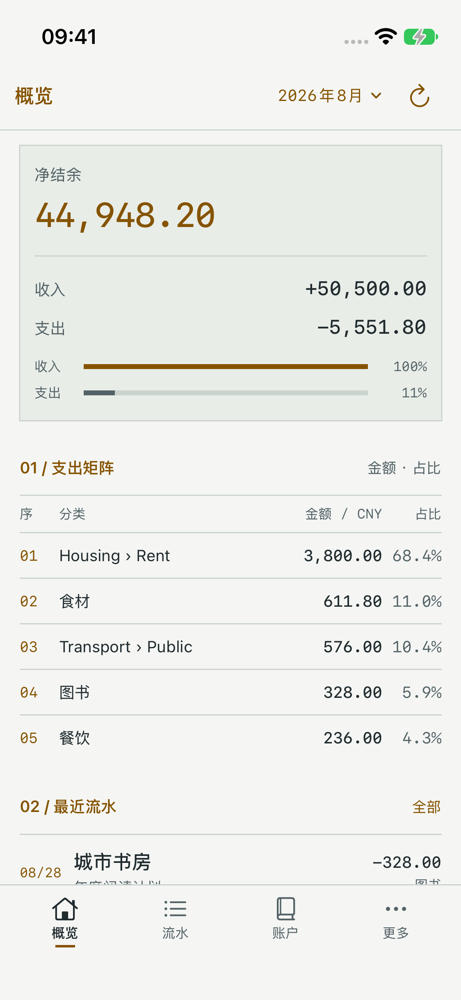
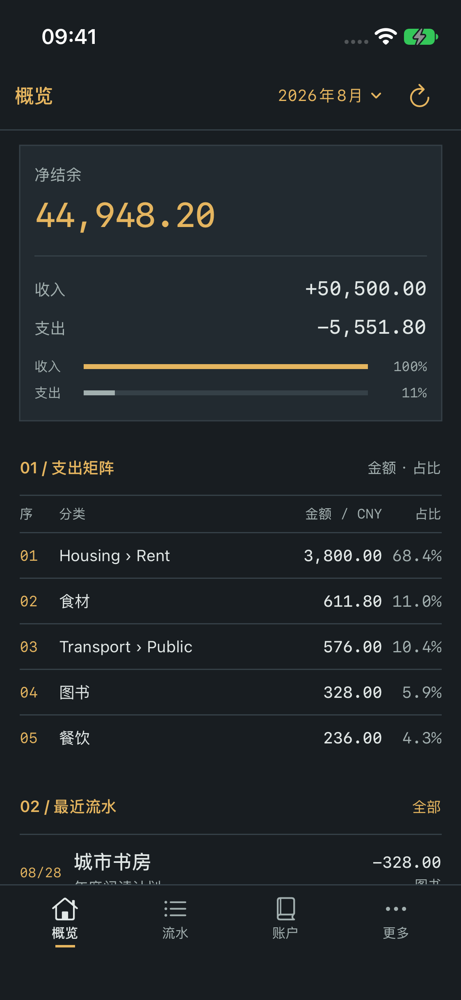

# Native terminal design

The approved visual reference is the terminal variant. This native increment covers reusable visual primitives, overview, and the compact navigation strip; other content screens retain their current implementation.

| Token | Light | Dark |
| --- | --- | --- |
| Page | `#F5F6F4` | `#181D21` |
| Panel | `#E9EDE8` | `#222A30` |
| Text | `#202B2E` | `#E1E7E6` |
| Secondary | `#536266` | `#A2AFAF` |
| Rule | `#CBD3CF` | `#354047` |
| Accent | `#855300` | `#E5B55F` |

System Chinese typography with monospaced amounts, square summary borders, 1 pt rules, no content shadows or gradients. Content fonts scale with Dynamic Type; accessibility category rows stack vertically. The navigation controls keep 44 pt hit targets.

The implementation follows the terminal prototype's CSS dimensions:

| Element | Default logical size |
| --- | --- |
| Header | 56 pt, 12 pt horizontal inset, 16 pt title |
| Date | 13 pt plain text and chevron, no calendar or capsule |
| Sync | 18 pt outline glyph, 44 pt target beside date |
| Content | 16 pt horizontal, 12 pt top, 16 pt section gaps |
| Summary | 16 pt vertical / 12 pt horizontal inset; 28 pt medium net |
| Income and expense | 13 pt labels, 16 pt values; separate 4 pt ratio bars |
| Category table | 13 pt rows, 11 pt header, 32 pt sequence / 48 pt share columns |
| Recent transaction | 36 pt date column, 16 pt title, 12 pt subtitle, 13 pt amount |
| Compact navigation | Flat 60 pt strip, four default destinations, 18 pt icons / 11 pt labels |

Amounts omit repeated currency symbols where the summary/table establishes the unit; VoiceOver retains the currency. Transactions in a different currency still show their symbol. Category rows include all positive categories rather than truncating at four.

Overview hierarchy: one navigation row (title, compact date, optional sync icon), net balance and income/expense, spending matrix, recent transactions. The date sheet edits a draft; cancel does not change the active range. No duplicate period row or quick-entry dock.

Local-only ledgers have no sync icon. Configured Git ledgers show their actual repository state; tapping the icon opens storage details and does not immediately sync. Counts/timestamps from the prototype are not fabricated. Server mode retains an explicitly labeled refresh action.

Amounts and derived proportions obey the existing visibility setting. Category aggregation uses the full local period aggregate, not just the loaded transaction page. Transactions and manual write confirmation continue through existing native views.

Simulator screenshots are stored alongside this document after verification and use safe synthetic preview data only.

## Simulator evidence

All images use the safe synthetic preview fixture on an iPhone 13 mini (375 pt). Its refresh icon belongs to server preview mode. The Git status/details and local-only hidden state are separately exercised by `LocalSyncToolbarUITests` against an isolated local ledger.

| Light | Dark |
| --- | --- |
|  |  |

Additional checks: [local Git synced state](overview-synced.png), [largest accessibility type](overview-accessibility.png), [amounts hidden](overview-private.png), [date sheet](date-sheet-dark.png).

The fidelity correction is validated with simulator builds, 34 `LedgerModelsTests` (including currency precision and symbol omission), and nine focused UI scenarios. These cover light/dark date draft/apply/cancel, native detail return, header geometry, all category rows, accessibility reachability, privacy masking, local Git status/details, configurable tabs and overflow return, and global search state across tabs/detail navigation. No full-app sweep, iPad runtime, physical-device, signing, or IPA distribution acceptance is implied.

The compact system tab strip is replaced because iOS 26+ imposes floating glass geometry. Independent navigation stacks and configurable destinations remain; global search is accessible from More. The regular sidebar and other content pages remain in their existing design. Shared date controls use native sheets and pickers with terminal colors; all accounting calculations and transaction confirmation flows continue through the existing models and views.
